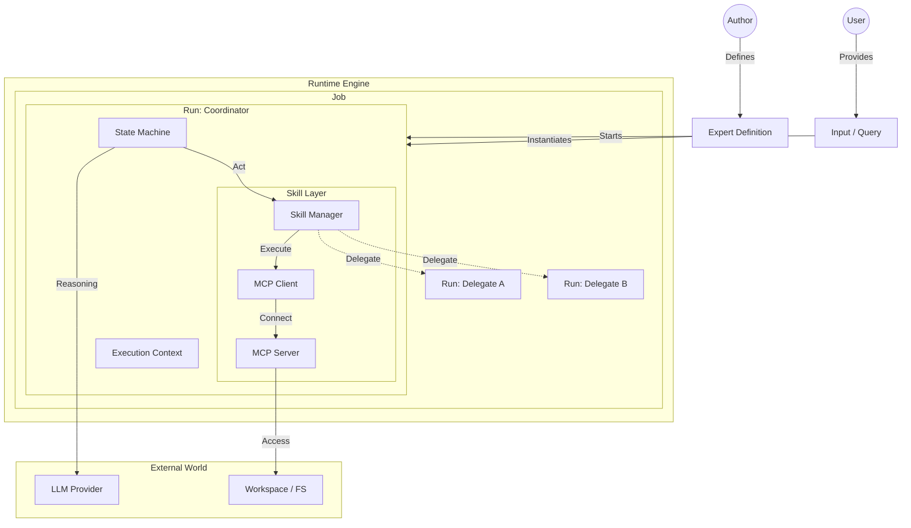
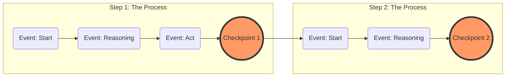
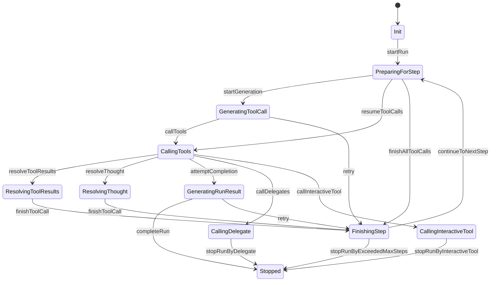

# @perstack/runtime

The **Execution Engine** for Perstack agents.

This package serves as the engine of Perstack. It orchestrates the lifecycle of an agent's execution, manages state, bridges the gap between LLMs and tools, and handles multi-agent coordination.

## Installation

```bash
npm install @perstack/runtime
```

## CLI Usage

The runtime can be executed as a standalone CLI:

```bash
perstack-runtime run <expertKey> <query> [options]
```

### Options

| Option | Description |
| --- | --- |
| `--config <path>` | Path to perstack.toml |
| `--provider <provider>` | LLM provider |
| `--model <model>` | Model name |
| `--temperature <temp>` | Temperature (0.0-1.0) |
| `--max-steps <n>` | Maximum steps |
| `--max-retries <n>` | Maximum retries |
| `--timeout <ms>` | Timeout in milliseconds |
| `--job-id <id>` | Job ID |
| `--run-id <id>` | Run ID |
| `--env-path <path...>` | Environment file paths |
| `--continue-job <jobId>` | Continue a job |
| `--resume-from <checkpointId>` | Resume from checkpoint |

### Example

```bash
perstack-runtime run my-expert "What is the weather?" --config ./perstack.toml
```

Output is JSON events (one per line) to stdout.

## Programmatic Usage

The primary entry point is the `run` function. It takes a `JobSetting` object and an optional `RunOptions` object.

```typescript
import { run } from "@perstack/runtime"
import { type JobSetting } from "@perstack/core"

// Configure the job
const setting: JobSetting = {
  jobId: "job-123",
  expertKey: "researcher",
  input: { text: "Research quantum computing" },
  // ... configuration for model, experts, etc.
}

// Execute the job
const finalJob = await run({ setting }, {
  eventListener: (event) => {
    console.log(`[${event.type}]`, event)
  }
})
```

### Event Object

The `eventListener` callback receives a `RunEvent` object, which provides granular details about the execution.

```typescript
type RunEvent = {
  type: EventType       // e.g., "startRun", "callTools"
  id: string            // Unique event ID
  timestamp: number     // Unix timestamp
  jobId: string         // ID of the Job
  runId: string         // ID of the current Run
  stepNumber: number    // Current step number within this Run
  // ... plus payload specific to the event type
}
```

You can narrow down the event type to access specific properties:

```typescript
eventListener: (event) => {
  if (event.type === "callTools") {
    // event is now narrowed to the callTools event type
    console.log(`Executing ${event.toolCalls.length} tools`)
  }
}
```

## Package Responsibilities

1. **Expert Realization**: The engine that brings declaratively defined Experts to life, realizing the desired state described by the developer.
2. **Lifecycle**: Drives the main execution loop of the agent (Reasoning -> Act -> Observe, repeat).
3. **State Management**: Maintains the canonical state of an execution in the form of **Checkpoints**, enabling pause/resume and time-travel.
4. **Skill Provider**: Provides the client side of the **Model Context Protocol (MCP)** to securely execute tools.
5. **Expert Delegation**: Implements the protocol for **Expert-to-Expert delegation**, allowing agents to call each other.

## Skill Manager

The runtime manages skills through specialized Skill Managers. Each skill type has its own manager class:

| Type            | Manager                   | Purpose                             |
| --------------- | ------------------------- | ----------------------------------- |
| MCP (stdio/SSE) | `McpSkillManager`         | External tools via MCP protocol     |
| Interactive     | `InteractiveSkillManager` | User input tools (Coordinator only) |
| Delegate        | `DelegateSkillManager`    | Expert-to-Expert calls              |

All managers extend `BaseSkillManager` which provides:
- `init()` — Initialize the skill (connect MCP servers, parse definitions)
- `close()` — Clean up resources (disconnect MCP servers)
- `getToolDefinitions()` — Get available tools
- `callTool()` — Execute a tool call

**Note:** Interactive skills are only available to the Coordinator Expert. See [Experts documentation](https://docs.perstack.ai/understanding-perstack/experts#why-no-interactive-tools-for-delegates) for details.

### Initialization Flow

```
getSkillManagers(expert, experts, setting)
    │
    ├─► Initialize MCP skills (parallel)
    │   └─► McpSkillManager × N
    │
    ├─► Initialize Interactive skills (Coordinator only)
    │   └─► InteractiveSkillManager × N
    │
    └─► Initialize Delegate skills (parallel)
        └─► DelegateSkillManager × N

Result: Record<skillName, BaseSkillManager>
```

If any skill fails to initialize, all previously initialized skills are cleaned up before throwing.

## Architecture

The runtime orchestrates the interaction between the user's definition of an Expert and the actual execution environment.



## Core Concepts

### Execution Hierarchy

```
Job (jobId)
 ├── Run 1 (Coordinator Expert)
 │    └── Checkpoints...
 ├── Run 2 (Delegated Expert A)
 │    └── Checkpoints...
 └── Run 3 (Delegated Expert B)
      └── Checkpoints...
```

| Concept        | Description                                  |
| -------------- | -------------------------------------------- |
| **Job**        | Top-level execution unit. Contains all Runs. |
| **Run**        | Single Expert execution.                     |
| **Checkpoint** | Snapshot at step end. Enables pause/resume.  |

For details on step counting, Coordinator vs. Delegated Expert differences, and the full execution model, see [Runtime](https://docs.perstack.ai/understanding-perstack/runtime).

### Events, Steps, Checkpoints

The runtime's execution model can be visualized as a timeline where **Events** are points, **Steps** are the lines connecting them, and **Checkpoints** are the anchors.



#### 1. Events
**Events** are granular moments in time that occur *during* execution. They represent specific actions or observations, such as "started reasoning", "called tool", or "finished tool".

#### 2. Step
A **Step** is the continuous process that connects these events. It represents one atomic cycle of the agent's loop (Reasoning -> Act -> Observe, repeat).

#### 3. Checkpoint
A **Checkpoint** is the immutable result at the end of a Step. It serves as the anchor point that:
- Finalizes the previous Step.
- Becomes the starting point for the next Step.
- Allows the execution to be paused, resumed, or forked from that exact moment.

## Internal State Machine

The runtime ensures deterministic execution through a strictly defined state machine.



### Events
Events trigger state transitions. They are emitted by the runtime logic or external inputs.

- **Lifecycle**: `startRun`, `startGeneration`, `continueToNextStep`, `completeRun`
- **Tool Execution**: `callTools`, `resolveToolResults`, `finishToolCall`, `resumeToolCalls`, `finishAllToolCalls`
- **Special Types**: `resolveThought`
- **Delegation**: `callDelegate` (triggers new Run(s) for delegate(s), parallel when multiple)
- **Interactive**: `callInteractiveTool` (Coordinator only)
- **Interruption**: `stopRunByInteractiveTool`, `stopRunByDelegate`, `stopRunByExceededMaxSteps`
- **Error Handling**: `retry`

## Checkpoint Status

The `status` field in a Checkpoint indicates the current state:

- `init`, `proceeding` — Run lifecycle
- `completed` — Task finished successfully
- `stoppedByInteractiveTool`, `stoppedByDelegate` — Waiting for external input
- `stoppedByExceededMaxSteps`, `stoppedByError` — Run stopped

For stop reasons and error handling, see [Error Handling](https://docs.perstack.ai/using-experts/error-handling).

## Runtime Adapters

The runtime supports multiple execution backends through the adapter pattern. External runtime adapters are provided as separate packages:

| Package                 | Runtime Name  | Description                |
| ----------------------- | ------------- | -------------------------- |
| `@perstack/runtime`     | `perstack`    | Built-in runtime (default) |
| `@perstack/cursor`      | `cursor`      | Cursor IDE headless mode   |
| `@perstack/claude-code` | `claude-code` | Claude Code CLI            |
| `@perstack/gemini`      | `gemini`      | Gemini CLI                 |

### Registration Pattern

External adapters must be registered before use:

```typescript
import { CursorAdapter } from "@perstack/cursor"
import { getAdapter, isAdapterAvailable, registerAdapter } from "@perstack/runtime"

// Register external adapter
registerAdapter("cursor", () => new CursorAdapter())

// Check availability
if (isAdapterAvailable("cursor")) {
  const adapter = getAdapter("cursor")
  const result = await adapter.checkPrerequisites()
  if (result.ok) {
    await adapter.run({ setting, eventListener })
  }
}
```

### Creating Custom Adapters

Extend `BaseAdapter` from `@perstack/core` for CLI-based runtimes:

```typescript
import { BaseAdapter, type AdapterRunParams, type AdapterRunResult, type PrerequisiteResult } from "@perstack/core"

class MyAdapter extends BaseAdapter {
  readonly name = "my-runtime"
  
  async checkPrerequisites(): Promise<PrerequisiteResult> {
    const result = await this.execCommand(["my-cli", "--version"])
    return result.exitCode === 0
      ? { ok: true }
      : { ok: false, error: { type: "cli-not-found", message: "..." } }
  }
  
  async run(params: AdapterRunParams): Promise<AdapterRunResult> {
    // Implementation
  }
}
```

See [Multi-Runtime Support](https://docs.perstack.ai/using-experts/multi-runtime) for details.

## Related Documentation

- [Runtime](https://docs.perstack.ai/understanding-perstack/runtime) — Full execution model
- [State Management](https://docs.perstack.ai/using-experts/state-management) — Jobs, Runs, and Checkpoints
- [Running Experts](https://docs.perstack.ai/using-experts/running-experts) — CLI usage
- [Multi-Runtime](https://docs.perstack.ai/using-experts/multi-runtime) — Multi-runtime support
