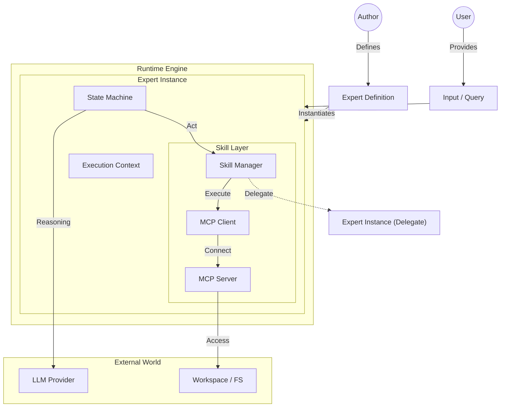
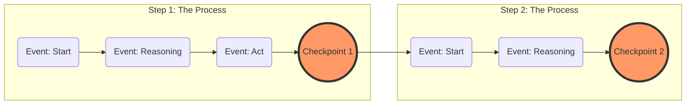
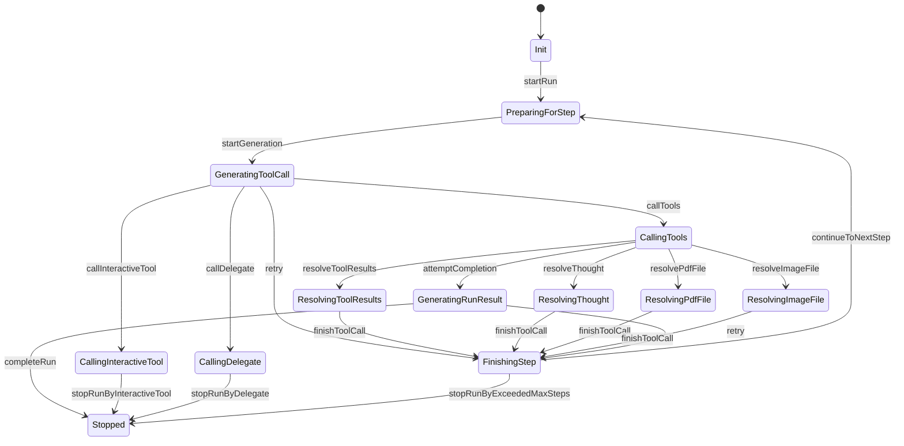

# @perstack/runtime

The **Execution Engine** for Perstack agents.

This package serves as the engine of Perstack. It orchestrates the lifecycle of an agent's execution, manages state, bridges the gap between LLMs and tools, and handles multi-agent coordination.

## Installation

```bash
npm install @perstack/runtime
```

## Usage

The primary entry point is the `run` function. It takes a `RunSetting` object and an optional `RunOptions` object.

```typescript
import { run } from "@perstack/runtime"
import { type RunSetting } from "@perstack/core"

// Configure the run
const setting: RunSetting = {
  runId: "run-123",
  expertKey: "researcher",
  input: { text: "Research quantum computing" },
  // ... configuration for model, experts, etc.
}

// Execute the run
const finalCheckpoint = await run({ setting }, {
  eventListener: (event) => {
    console.log(`[${event.type}]`, event)
  }
})
```

### Event Object

The `eventListener` callback receives a `RunEvent` object, which provides granular details about the execution.

```typescript
type RunEvent = {
  type: EventType       // e.g., "startRun", "callTools"
  id: string            // Unique event ID
  timestamp: number     // Unix timestamp
  runId: string         // ID of the current run
  stepNumber: number    // Current step number
  // ... plus payload specific to the event type
}
```

You can narrow down the event type to access specific properties:

```typescript
eventListener: (event) => {
  if (event.type === "callTools") {
    // event is now narrowed to the callTools event type
    console.log(`Executing ${event.toolCalls.length} tools`)
  }
}
```

## Package Responsibilities

1. **Expert Realization**: The engine that brings declaratively defined Experts to life, realizing the desired state described by the developer.
2. **Lifecycle**: Drives the main execution loop of the agent (Reasoning -> Act -> Observe, repeat).
3. **State Management**: Maintains the canonical state of an execution in the form of **Checkpoints**, enabling pause/resume and time-travel.
4. **Skill Provider**: Provides the client side of the **Model Context Protocol (MCP)** to securely execute tools.
5. **Expert Delegation**: Implements the protocol for **Expert-to-Expert delegation**, allowing agents to call each other.

## Skill Manager

The runtime manages skills through specialized Skill Managers. Each skill type has its own manager class:

| Type            | Manager                   | Purpose                            |
| --------------- | ------------------------- | ---------------------------------- |
| MCP (stdio/SSE) | `McpSkillManager`         | External tools via MCP protocol    |
| Interactive     | `InteractiveSkillManager` | User input tools (pause execution) |
| Delegate        | `DelegateSkillManager`    | Expert-to-Expert calls             |

All managers extend `BaseSkillManager` which provides:
- `init()` — Initialize the skill (connect MCP servers, parse definitions)
- `close()` — Clean up resources (disconnect MCP servers)
- `getToolDefinitions()` — Get available tools
- `callTool()` — Execute a tool call

### Initialization Flow

```
getSkillManagers(expert, experts, setting)
    │
    ├─► Initialize MCP skills (parallel)
    │   └─► McpSkillManager × N
    │
    ├─► Initialize Interactive skills (parallel)
    │   └─► InteractiveSkillManager × N
    │
    └─► Initialize Delegate skills (parallel)
        └─► DelegateSkillManager × N

Result: Record<skillName, BaseSkillManager>
```

If any skill fails to initialize, all previously initialized skills are cleaned up before throwing.

## Architecture

The runtime orchestrates the interaction between the user's definition of an Expert and the actual execution environment.



## Core Concepts

The runtime's execution model can be visualized as a timeline where **Events** are points, **Steps** are the lines connecting them, and **Checkpoints** are the anchors.



### 1. Events
**Events** are granular moments in time that occur *during* execution. They represent specific actions or observations, such as "started reasoning", "called tool", or "finished tool".

### 2. Step
A **Step** is the continuous process that connects these events. It represents one atomic cycle of the agent's loop (Reasoning -> Act -> Observe, repeat).

### 3. Checkpoint
A **Checkpoint** is the immutable result at the end of a Step. It serves as the anchor point that:
- Finalizes the previous Step.
- Becomes the starting point for the next Step.
- Allows the execution to be paused, resumed, or forked from that exact moment.

## Internal State Machine

The runtime ensures deterministic execution through a strictly defined state machine.



### Events
Events trigger state transitions. They are emitted by the runtime logic or external inputs.

- **Lifecycle**: `startRun`, `startGeneration`, `continueToNextStep`, `completeRun`
- **Tool Execution**: `callTools`, `resolveToolResults`, `finishToolCall`
- **Special Types**: `resolveThought`, `resolvePdfFile`, `resolveImageFile`
- **Interruption**: `stopRunByInteractiveTool`, `stopRunByDelegate`, `stopRunByExceededMaxSteps`
- **Error Handling**: `retry`

## Checkpoint Status

The `status` field in a Checkpoint indicates the current state of the execution.

- **init**: The run has been created but not yet started.
- **proceeding**: The run is currently active and executing steps.
- **completed**: The run has finished successfully.
- **stoppedByInteractiveTool**: The run is paused, waiting for user input (e.g., confirmation or parameter entry).
- **stoppedByDelegate**: The run is paused, waiting for a delegated sub-agent to complete.
- **stoppedByExceededMaxSteps**: The run stopped because it reached the maximum allowed steps.
- **stoppedByError**: The run stopped due to an unrecoverable error.

## Related Documentation

- [Running Experts](https://perstack.ai/docs/using-experts/running-experts) - How to run Experts
- [State Management](https://perstack.ai/docs/using-experts/state-management) - Understanding checkpoints and state

